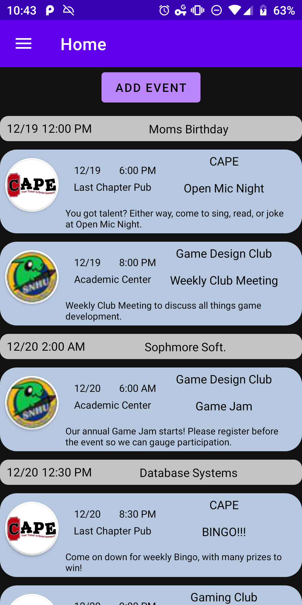
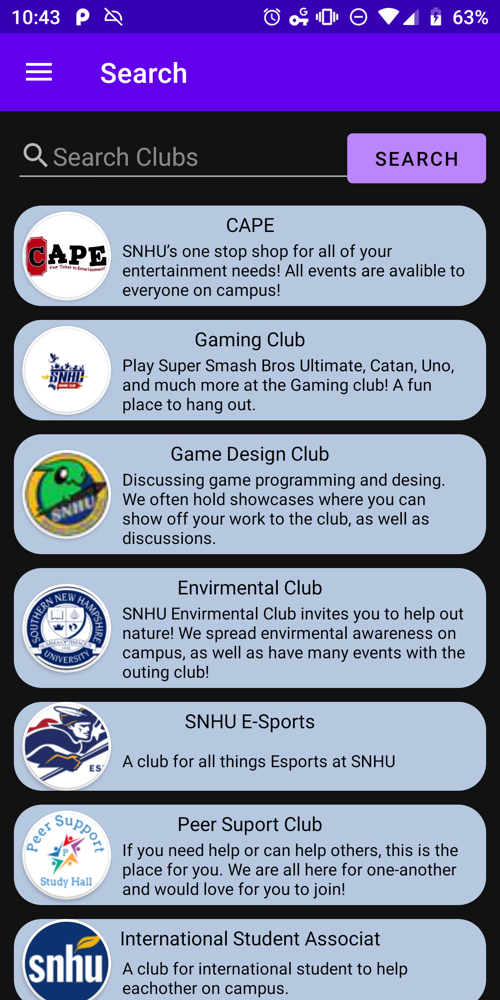
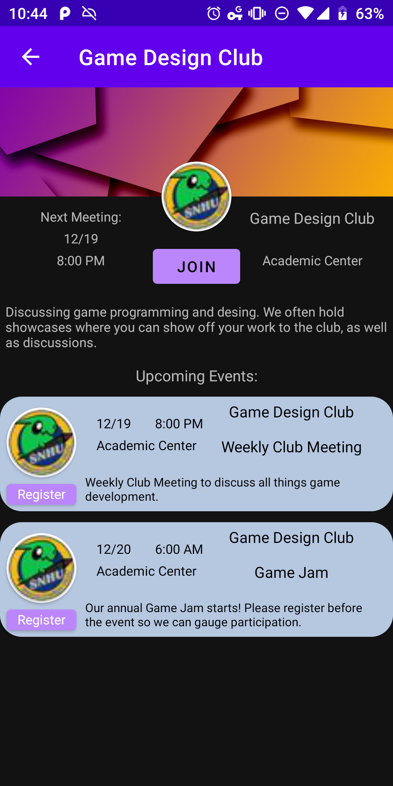
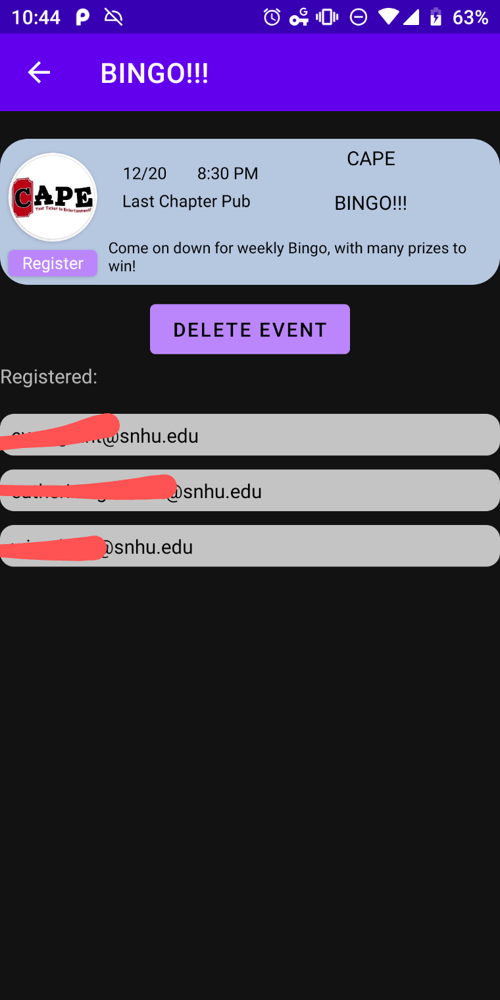

# Eventified
An Android event planner for clubs and their members in universities and other organizations. Currently under early development and not intended for use. Made by William Parker and Francis Lapointe for our CS203 Software Engineering class.

Note: links to our external server may be down to prevent spam and unwanted requests durring development. for inquiries, please contact william.parker3@snhu.edu

